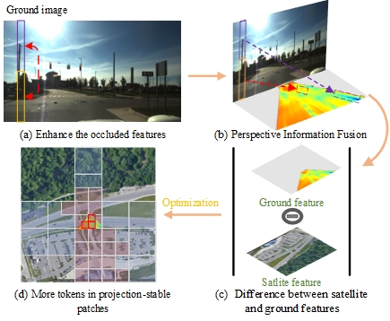
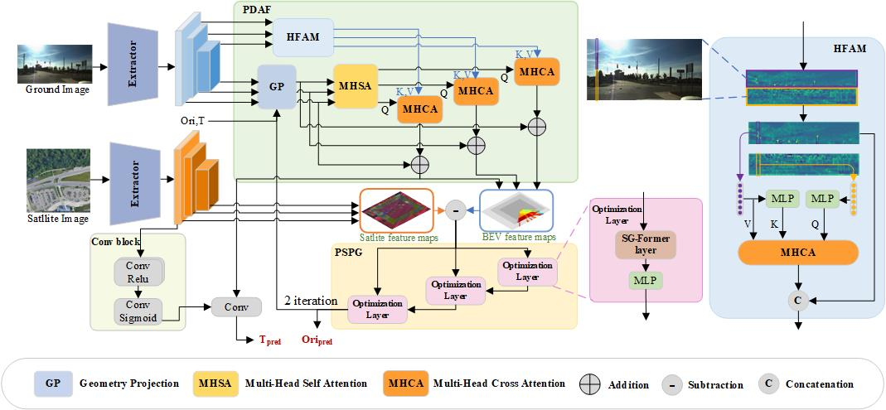

<h2 align="center">Focusing on Projection-Stable Patch: Cross-View Localization with Geometric-Semantic Alignment</h2>

<a >Riyu Qin</a>, 
<a >Zhengyu Liu</a>,
<a >Kaiyang Wang</a>,
<a >Xia Yuan</a>*,
 

## Partial Content

Fig.1 :overview of the proposed method.The method mitigates occlusion effects through a perspective-driven attention fusion module (a)-(b) that projects ground view feature map to satellite view representations. A projection-stable patch optimizer (d) then refines camera pose estimation by minimizing discrepancies between transformed ground features and satellite-view features (c), achieving high-precision rotation estimation.

 

Fig.2 :Framework of the proposed method. (1) PDAF: perspective-driven attention fusion module. (2) HFAM: hierarchical feature aggregation module (3) PSPG:projection-stable patch-guided pose optimizer.The initial orientation (Ori) and translation (T) serve as initial inputs to the geometry projection. During each subsequent iteration, the updated orientation parameters and translation values are fed back into the geometric projection process. Through two complete iteration cycles, PSPG produces the final orientation estimation (Ori_pred), which subsequently guides the location branch to generate the translation estimation (T_pred).   
 

## Datasets
- KITTI dataset: please refer to https://github.com/shiyujiao/HighlyAccurate to download the dataset.
- Ford multi-AV: please refer to https://github.com/shiyujiao/HighlyAccurate to download the dataset.

## Codes
will be release soon！
